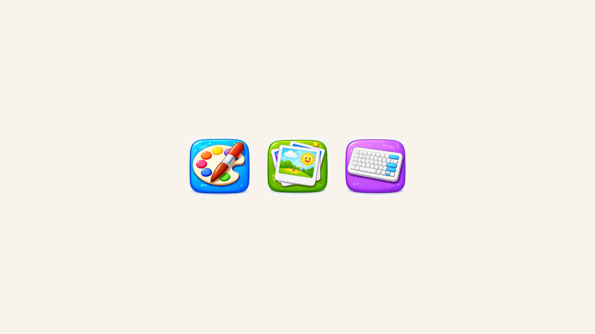
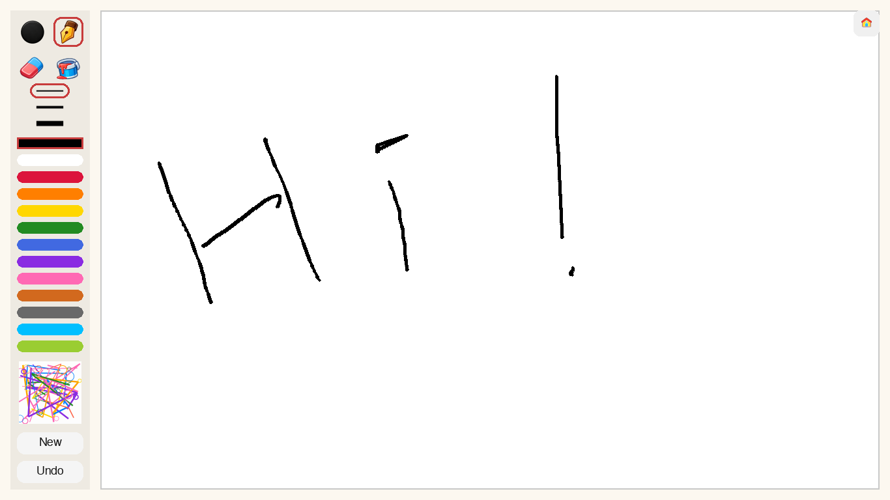
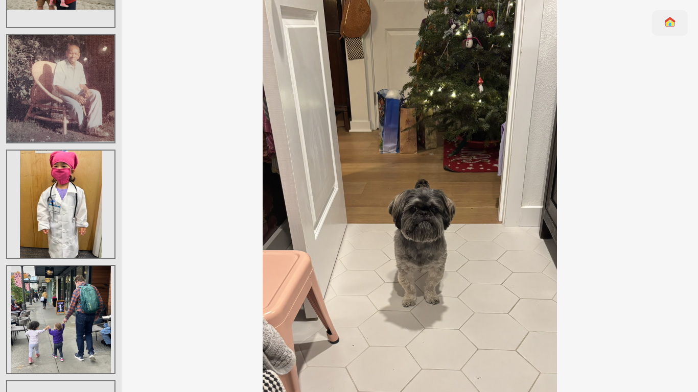
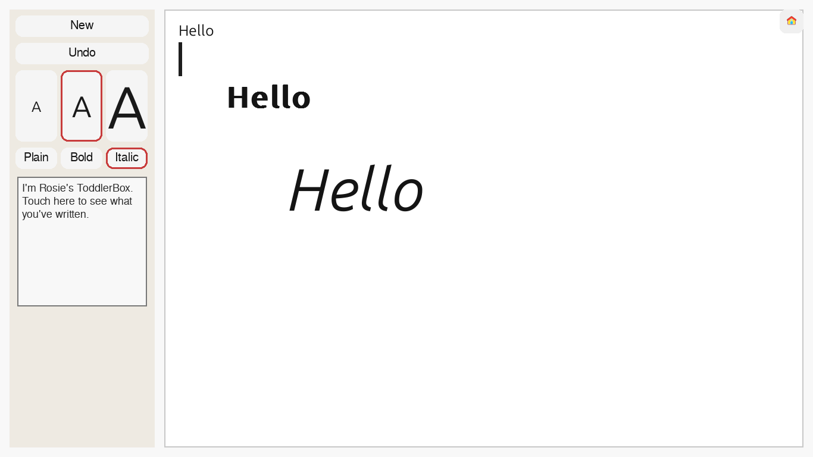

# ToddlerBox

**ToddlerBox** is a minimalist, offline-first Linux "kid mode" designed for very young children.
By default it boots into a fullscreen launcher with three large buttons:

- **Paint**
- **Photos**
- **Typing**

There is no desktop environment visible, no file browser, no login/logout flow, and no network dependency during normal use. The system is intentionally constrained, predictable, and robust against accidental input, while remaining easy for a parent to administer and extend.

This is not a general-purpose “kids OS.”
It is a small, comprehensible appliance built on top of Ubuntu.

---

## Design Goals

- **Appliance-like UX**
  - Power on -> launcher -> activity
  - No system UI exposed
- **Touch-first**
  - Large hit targets
  - No right-clicks, menus, or dialogs
- **Safe by construction**
  - Autosave everywhere
  - Undo everywhere
  - "New" never destroys work
- **Offline by default**
  - No network dependency during normal use
- **Parent-controlled escape**
  - Hidden keyboard chord exits to parent shell on `tty1`
- **Grow-with-the-child**
  - Built-in apps run in-process for smooth transitions
  - Non-built-in apps can still be launched via subprocess fallback
  - Full desktop can be re-enabled later without reinstalling

---

## Keyboard hardening (toddler-proofing)

In a real kiosk setup, OS-level key handling still matters (e.g. `Super`/Windows, media keys, brightness, airplane mode).
ToddlerBox ignores some keys in-app, but the most robust approach is to no-op escape-hatch keys at the Linux input level (works on Wayland too).

- Example `keyd` config generator: `scripts/noop_keys_keyd.sh`

---

## High-level Architecture

```
┌────────────────────────────┐
│        ToddlerBox          │
│  (Fullscreen Launcher)     │
│                            │
│  [ Paint ] [ Photos ]      │
│          [ Typing ]        │
│                            │
└─────────────┬──────────────┘
              │ switches scenes in-process
┌─────────────▼──────────────┐
│      Embedded App Views    │
│  - Paint                   │
│  - Photos                  │
│  - Typing                  │
│                            │
│  Fullscreen, no chrome     │
│  Exit = return to launcher │
└────────────────────────────┘

Underlying system:
- Ubuntu + systemd + Cage (Wayland kiosk compositor)
- Python 3
- pygame-ce / SDL
```

The launcher supervises apps. Apps exit cleanly back to the launcher. If an app crashes, the launcher simply reappears.

---

## Screenshots

### Launcher

Fullscreen home screen with large, simple app targets.



### Paint

Drawing canvas with kid-sized tools, palette, and autosave workflow.



### Photos

Main photo view with left thumbnail selector strip and swipe navigation.



### Typing

Large-format typing surface with per-character styling controls and recall.



---

## Components

### Launcher

- Fullscreen home screen with three icons
- Runs built-in apps in-process (`paint`, `photos`, `typing`)
- Subprocess fallback for non-built-in commands in config
- No clickable "exit" control on-screen
- Ignores function keys (`F1`-`F12`)
- **Parent escape chord:** `Ctrl + Alt + Home`
  - Exits the launcher/Cage session and returns to `tty1`

### Paint App

- Free drawing canvas
- Tools:
  - Round brush
  - Fountain pen (direction-sensitive width)
  - Eraser
  - Bucket fill
- 3 line-size options (small/medium/large)
- 14-color palette (configurable)
- Stroke-based undo (default depth: 10)
- Autosave + archive on "New"
- Recall overlay in the left tools panel:
  - First item is the current live canvas
  - Older archives below in a vertical scroll list
  - Tap outside recall closes it

### Photos App

- Photo library viewer
- Main image area + always-visible thumbnail strip on the left
- Swipe left/right to navigate
- Home button at top-right
- Photos are loaded from `data_root/photos/library`
- Thumbnail cache is stored in `data_root/photos/thumbs`

### Typing App

- Freeform text area with rich per-character styling
- Left control panel includes:
  - `New`, `Undo`
  - Font size buttons (`25`, `50`, `100`) with sample "A"
  - Font style buttons (`Plain`, `Bold`, `Italic`)
  - Recall thumbnail tile
- Styling changes apply to newly typed text from the cursor forward
- Undo and New supported (`Undo` depth 20)
- Recall overlay in the left panel shows saved session previews
- Session logs archived silently as rich glyph JSON in `sessions.jsonl`

---

## Data Layout

All child-generated data lives under a single directory, configured by `data_root`:

```
/data/
├── paint/
│   ├── latest.png
│   └── YYYY-MM-DD_HHMMSS.png
├── photos/
│   ├── library/
│   └── thumbs/
├── logs/
│   ├── toddlerbox.log
│   └── toddlerbox.log.1
└── typing/
    └── sessions.jsonl
```

- No file dialogs
- No delete UI
- Parent manages files externally if desired

---

## Configuration

Runtime configuration is read from `config.yaml` (repo root for dev) or `/opt/toddlerbox/config.yaml` (deployment). Key settings:

- `data_root` (default dev config: `./data`)
- `launcher.apps` (icon paths + commands)
- `paint.autosave_seconds`
- `paint.palette`

---

## Icons

Launcher icons are provided as pre-rendered PNGs with:

- Transparent background
- Normalized padding
- Multiple resolutions (256 / 512 / 1024)

They are stored in:

```
assets/icons/
```

---

## Development Setup

### Requirements

- Ubuntu 22.04 or 24.04
- Python ≥ 3.10
- SDL-compatible graphics (works on older Intel laptops)

### Dev environment (recommended)

Development uses `uv` with a local `.venv`:

```bash
uv sync
```

## Convenience Script

```bash
./scripts/dev-run.sh
./scripts/dev-run.sh paint
./scripts/dev-run.sh photos
./scripts/dev-run.sh typing
./scripts/dev-run.sh tests
```

`scripts/dev-run.sh` is for development and exits on crash.

For kiosk-style resilience testing, use:

```bash
./scripts/run-stable.sh
```

`scripts/run-stable.sh` restarts the launcher automatically with bounded backoff if it exits unexpectedly.

---

## Running the Apps

From the repo root:

```bash
uv run python -m toddlerbox.launcher
uv run python -m toddlerbox.paint
uv run python -m toddlerbox.photos
uv run python -m toddlerbox.typing
```

---

## Cage GDM Kiosk Setup (Deployment)

ToddlerBox default deployment now boots into a GDM-controlled session where the `toddlerbox` user is automatically logged into a dedicated `toddlerbox` Wayland session that runs `scripts/kiosk-session.sh` inside Cage.

### 1) Install system packages

```bash
sudo apt update
sudo apt install -y cage seatd dconf-cli
sudo systemctl enable --now seatd
sudo usermod -aG seat,input,video,render toddlerbox
```

Or run the repo helper:

```bash
./scripts/configure-kiosk-system.sh <user>
```

This helper now installs the toddlerbox Wayland session, configures `/etc/gdm3/custom.conf` for automatic login, and enables GDM so the kiosk session starts immediately after boot.

Note: after group changes, log out/in or reboot before testing kiosk startup.

### 2) Install/update ToddlerBox runtime

From repo root:

```bash
./scripts/install-runtime.sh
```

This runs a lockfile-based install:

```bash
uv sync --frozen --no-dev
```

### 3) Create the toddlerbox Wayland session

Create `/usr/share/wayland-sessions/toddlerbox.desktop` with the following contents:

```ini
[Desktop Entry]
Name=toddlerbox
Comment=toddlerbox
Exec=/home/<user>/git/ToddlerBox/scripts/kiosk-session.sh
Type=Application
DesktopNames=Cage
```

This session entry is what GDM launches for the kiosk user so that Cage starts with the launcher on login.

### 4) Configure GDM automatic login

Edit `/etc/gdm3/custom.conf` (or `/etc/gdm/custom.conf` on some systems) and replace the `[daemon]` block with:

```ini
[daemon]
AutomaticLoginEnable=true
AutomaticLogin=toddlerbox
DefaultSession=toddlerbox
```

After editing, `sudo systemctl enable --now gdm3` ensures the display manager is running at boot.

### 5) Parent escape behavior

`Ctrl + Alt + Home` exits the launcher, closes Cage, and returns parents to a shell on `tty1` (or follows the action configured in `system.parent_escape_action`).

### Rollback to GNOME boot

1. Remove `/usr/share/wayland-sessions/toddlerbox.desktop` (or rename it so GDM falls back to a standard session).
2. Restore `/etc/gdm3/custom.conf` with `AutomaticLoginEnable=false` (use the `.bak` copy if it exists).
3. Run:

```bash
sudo systemctl set-default graphical.target
sudo systemctl enable gdm3
```

4. Reboot and log in through the GNOME greeter as usual.

---

## Tests

```bash
uv run pytest
```

---

## Project Status

This is a personal project built for a real child on real hardware.
The emphasis is on **clarity, durability, and restraint**, not feature count.

Contributions are welcome if they respect the core design principles.

---

## License

MIT
